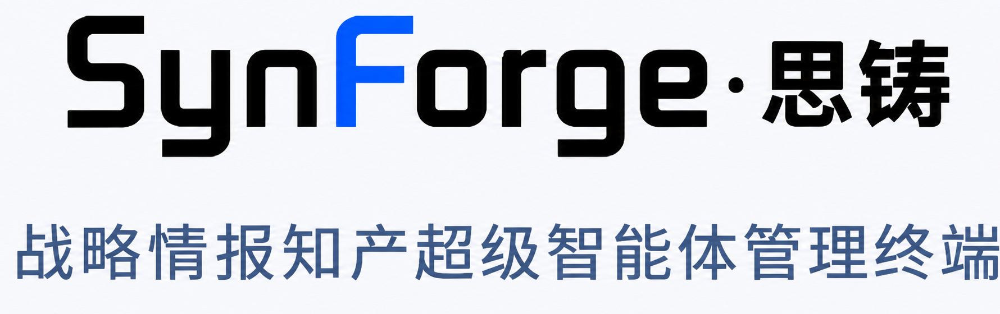

<p align="center">
  
</p>

# DeerFlow 上海电气分发版（SynForge）

基于 [bytedance/deer-flow](https://github.com/bytedance/deer-flow) 二次开发的上海电气内部分发版：一套 LangGraph 架构的 AI super-agent 系统（沙箱执行、持久记忆、子代理委派、可扩展工具），主线使用方式是 **Web UI**（浏览器打开统一入口即可，首次进入走 `/setup` 向导）。

本文以**分发版的二次开发内容**为主体；DeerFlow 上游背景、架构深度与公网文档见[文末指引](#deerflow-基础与文档地图)。

## 目录

- [分发版特性](#分发版特性)
  - [品牌与登录（SynForge）](#品牌与登录synforge)
  - [专利分析套件（patent-research.v2）](#专利分析套件patent-researchv2)
  - [技能系统与质量审核](#技能系统与质量审核)
  - [定时任务](#定时任务)
  - [MCP 远程工具媒体内联](#mcp-远程工具媒体内联)
  - [认证与多用户行为](#认证与多用户行为)
  - [前端增强与 IM 频道](#前端增强与-im-频道)
- [部署与运维](#部署与运维)
- [DeerFlow 基础与文档地图](#deerflow-基础与文档地图)
- [上游归属](#上游归属)

## 分发版特性

以下为上海电气分发版在上游 DeerFlow 基础上的长期增量；`codex/prod-canonical` 是唯一同步、定制和生产分支。

### 品牌与登录（SynForge）

- 打开 Web UI 即进入 SynForge 品牌登录页：根路由重定向 `/login`，登录页为 `frontend/src/app/(auth)/login/page.tsx`，品牌素材在 `frontend/public/images/branding/`。
- About 页、工作区头部、i18n（中/英）均已品牌化。
- 纪律：不要恢复上游公共落地页或替换品牌标识，除非有明确需求。

### 专利分析套件（patent-research.v2）

- `skills/public/` 下五个技能：`applicant-tech-patent-retrieval`、`evidence-based-labeling`、`technology-insight-analysis`、`tech-evolution-analysis`、`black-swan-tech-radar`。
- 运行时契约 `contracts/patent_skill_runtime/`（v2 schema + manifest + 架构文档）。
- 专利数据 MCP（`extensions_config.json → mcpServers.patent-data`）：成本管控（专用 token + 项目预算映射，未配置 client/项目的请求在计费前拒绝）、共享代理网络暴露、授权头解析、部署预检。

使用、配置、产物契约与方法学红线的完整说明见 [docs/patent-suite.md](docs/patent-suite.md)。

### 技能系统与质量审核

- 运行时策略：`allowed-tools` 仅对当前激活的技能生效（不再因某技能被启用就全局限流）。
- 技能显示名/描述支持 i18n overlay；默认禁用非必要公共技能（`extensions_config.example.json` 中各技能 `enabled: false`）。
- `skill-reviewer` 技能质量审核：只读，基于 harness 层 `review_skill_package` 工具与 `contracts/skill_review/` 契约；模型可见的审核数据经压缩与标签中和，完整原始载荷保留在工具 artifact 中。

### 定时任务

- Web UI 入口：工作区页面 `/workspace/scheduled-tasks`，由 `config.yaml` 中 `scheduler.enabled` 门控。
- 后台定时运行为非交互模式：`context.non_interactive=true` 时 lead agent 工具集排除 `ask_clarification`；该键仅对内部鉴权调用方（调度器启动链路）生效，客户端传入的同名键会被丢弃。

### MCP 远程工具媒体内联

- HTTP/SSE MCP 工具看不到 Gateway 的线程级 `/mnt/user-data` 挂载。当这类工具收到线程内的图片/视频路径时，网关将其解析为当前线程文件并内联为内存 `data:` URL（上限 4 MiB，超限在发起远程调用前拒绝）；原始虚拟路径保留在 agent 状态与历史中，载荷字节不进入模型可见参数、checkpoint 或运行记录。
- exa 工具支持 `base_url` 覆盖（hub 出口迁移）。

### 认证与多用户行为

- auth-disabled 模式下跳过 thread `owner_check`，artifact 解析支持跨 user bucket 回退。
- 浏览器认证使用 HttpOnly session cookie，并统一 remember-me 与 CSRF cookie 生命周期；部署可通过 `auth.local.allow_registration: false` 关闭普通访客自注册，同时保留首次管理员初始化和既有管理员登录。
- 支持数字底座（IPD）三方登录（自定义 OAuth2 授权码，用例二）：在 `config.yaml -> auth.oidc.providers` 配置 `provider_type: oauth2` 的 provider，前端 `/loginsso` 拦截 IPD 回调并转发后端换会话；本地登录、首次管理员初始化与既有 OIDC SSO 均不受影响。配置与协议差异见 [backend/docs/SSO.md](backend/docs/SSO.md)，需求与 IT 对接清单见 [docs/plans/2026-07-22-digital-foundation-sso-todo.md](docs/plans/2026-07-22-digital-foundation-sso-todo.md)。
- upstream 的可信 principal、可插拔 AuthorizationProvider 与内置 RBAC 基础设施已经进入代码基线；启用授权策略前仍需按部署需求完成配置和回归。
- 注意：`DEER_FLOW_AUTH_DISABLED=1` 等 dev-only 参数**上生产前必须移除**，完整清单见 [docs/production-deployment.md](docs/production-deployment.md)。

### 前端增强与 IM 频道

- 子任务时间线展示 tool-call 参数；favicon 替换；设置菜单精简。
- IM 频道（Feishu / Slack / Telegram / Discord / DingTalk）经 Gateway 桥接同一个 agent，实现位于 `backend/app/channels/`——分发版主线使用 Web UI，IM 细节见 [backend/AGENTS.md](backend/AGENTS.md)。

### 门户统计接口

- `GET /api/internal/portal-analytics/runs` 为 IP 门户提供只读、游标分页的终态运行事实。
- 接口只返回运行 ID、工号、时间、状态、耗时、模型与 token 数，不返回提示词、回答、附件、反馈或错误正文。
- 使用独立环境变量 `DEER_FLOW_PORTAL_ANALYTICS_TOKEN` 的 Bearer token；未配置时接口 fail-closed 返回 503。

## 部署与运维

### 服务拓扑

| 服务 | `make dev` | Docker 生产 | 角色 |
| --- | --- | --- | --- |
| Nginx | `12026` | `2026` | 统一入口（Web UI）；`/api/langgraph/*` 重写转发到 Gateway |
| Gateway API | `18001` | `8001` | FastAPI REST + 内嵌 LangGraph 运行时 |
| Frontend | `13000` | `3000` | Next.js Web UI |
| Provisioner | `8002` | `8002` | 可选，仅 provisioner/K8s 沙箱模式 |

生产 Docker 栈另含 `deer-flow-redis`。生产机 starl-38（`10.84.91.38`）上 Nginx 绑定 localhost 并加入 `web-network`，仅经域名对外；入口 `http://localhost:2026`。

### 快速开始

```bash
make setup       # 交互式安装向导（新环境推荐）；或 make config 手动生成配置
make doctor      # 检查配置与系统依赖
make dev         # 本地开发：Gateway(18001) + Frontend(13000) + Nginx(12026)，热重载
```

浏览器打开 `http://localhost:12026`，首次进入走 `/setup` 向导。模块级命令（`cd backend && make test` / `cd frontend && pnpm check` 等）见 [AGENTS.md](AGENTS.md)。

### 生产部署

`./scripts/deploy.sh` 是重建、启动、停止生产栈的**唯一支持入口**（Compose 项目名固定 `deer-flow`）：

```bash
./scripts/deploy.sh check    # 校验部署输入与运行中挂载，不动容器
./scripts/deploy.sh          # 无参 = build + start
./scripts/deploy.sh down     # 停止并移除容器
```

四条铁律（完整说明见 [docs/production-deployment.md](docs/production-deployment.md)）：

- **禁止**对 gateway / frontend / nginx 执行临时 `docker compose` 命令；操作范围仅限 `deer-flow` 项目（不得动 `ipa-gateway` 等无关容器）。
- `.dockerignore` 必须排除 `backend/.deer-flow`。
- 涉及 `frontend/` 的提交前必须本地验证 `pnpm install --frozen-lockfile`；锁文件只允许 pnpm 自己改写。
- 部署成功的判据：`config.yaml` 与 `extensions_config.json` 是宿主机普通文件且 gateway 挂载的正是这两个路径。

### 分支、远程与推送纪律

| 项 | 值 |
| --- | --- |
| 唯一生产与长期定制分支 | `codex/prod-canonical`（同步上游、维护企业定制和生产构建均使用该分支） |
| `origin` | `github.com/hahaxiao2918/deer-flow`（可写 fork） |
| `upstream` | `github.com/bytedance/deer-flow`（只读，push 已禁用） |
| `gitea` | `ssh://git@10.84.91.38:7023/hahaxiao/deer-flow.git`（starl-38 本机镜像，部署主通道） |

- **双远程推送**：每次推送须 `git push origin <branch> && git push gitea <branch>`；生产服务器从本机 Gitea 回环拉取，不受 GitHub 出口抖动影响。
- 标准发布流程与应急方案见 [docs/production-deployment.md](docs/production-deployment.md)；不改远程 URL、不 force-push、绝不推 `upstream`。

### 运行时配置

`config.yaml`（主配置）与 `extensions_config.json`（MCP + 技能开关）位于仓库根目录，均 gitignored，可经 Gateway API 热更新。绝不提交 token、`.env`、上述两个配置或 `.deer-flow` 运行数据；新增配置键前先在代码中确认有消费方（防死配置）；dev-only 参数必须登记到部署手册清单。

## DeerFlow 基础与文档地图

DeerFlow 上游是字节跳动开源的 LangGraph super-agent 框架：后端"超级代理"按线程隔离地调度沙箱、工具、子代理与持久记忆，前端为 Next.js 聊天界面。分发版未改动这些基础架构，深度资料：

- [AGENTS.md](AGENTS.md) — 仓库导览与跨模块约定（开发侧事实源）；模块深度：[backend/AGENTS.md](backend/AGENTS.md)、[frontend/AGENTS.md](frontend/AGENTS.md)
- [docs/production-deployment.md](docs/production-deployment.md) — 生产部署手册（运维交接事实源）
- [docs/patent-suite.md](docs/patent-suite.md) — 专利分析套件使用手册（启用、Web UI 用法、产物契约、成本纪律）
- 上游原版 README 及多语种翻译 → `.readme-archive/`（仅供 AI agent 参考）
- [SECURITY.md](SECURITY.md) — 安全策略（沿用上游）

## 上游归属

本项目是 [bytedance/deer-flow](https://github.com/bytedance/deer-flow) 的 fork，遵循上游 MIT 许可证（见 [LICENSE](LICENSE)，版权归 Bytedance 及 DeerFlow 作者所有）。
